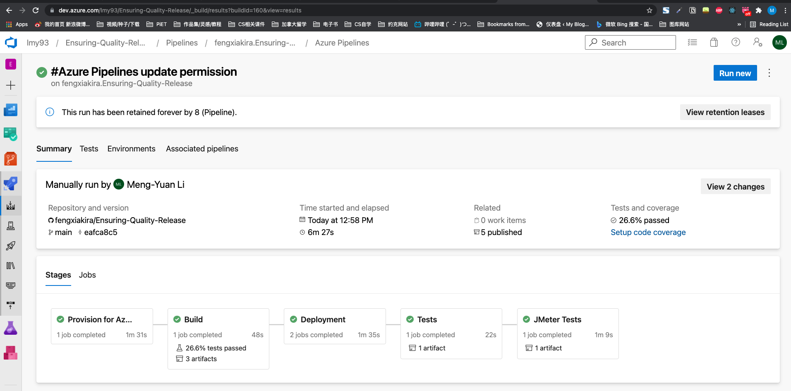
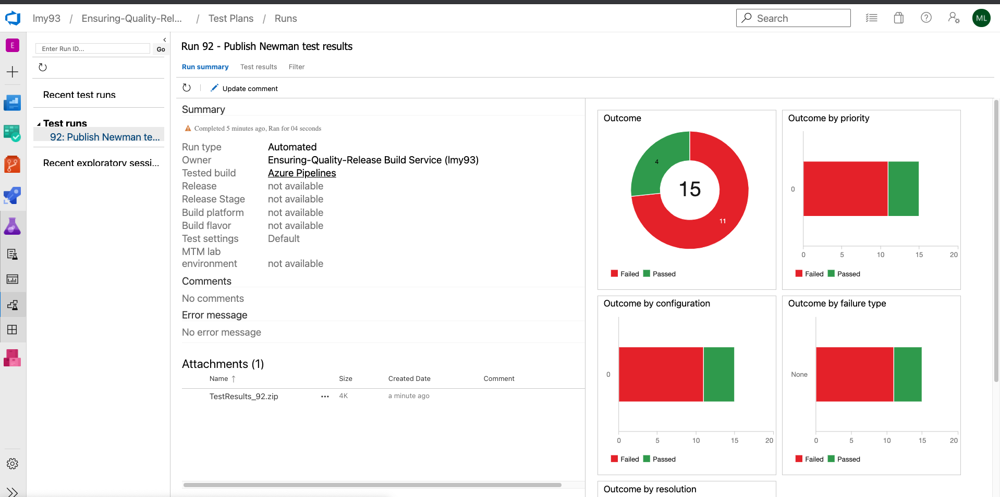

# Ensuring-Quality-Release
 
The project was a final project for Udacity DevOps Engineer for Microsoft Azure Nanodegree Program. It combines several Cloud tech stack such as Terraform for deploying an infrastructure as code, Azure DevOps pipeline for CI/CD process, Selenium for UI tests, JMeter for endurance and stress tests and Postman for Regression Test and Data Validation test.

Final pipeline output:

 ## Instructions

 ### Tools
- A free Azure Account.
- An Azure DevOps account.
- Install Azure CLI
- A VM image which installs python3, pip,JMeter, Newman and chromium-browser. Add chromedriver to PATH. It could be put in the resource group created by `create_storage.sh`. Record the image_id and update it in `./terraform/terraform.tfvars`
```
image_id = "Your VM image_id"
```

- An SSH key pair. This could be generated outside the VM we deployed. Private key shall be stored in Azure DevOps pipeline. Public key shall be stored in the VM image.


### Steps
1. In terminal, run `az login` with your Azure username and password.
2. [Create a Service Principal for Terraform](https://registry.terraform.io/providers/hashicorp/azurerm/latest/docs/guides/service_principal_client_secret).
3. Set your Azure Environment credentials as following. Keep it as `set_azure_env.sh` in the root folder.
```
echo "Setting environment variables for Terraform"
export ARM_CLIENT_ID="YOUR_ARM_CLIENT_ID"
export ARM_CLIENT_SECRET="YOUR_ARM_CLIENT_SECRET"
export ARM_SUBSCRIPTION_ID="YOUR_AZURE_SUBSCRIPTION_ID"
export ARM_TENANT_ID="YOUR_AZURE_TENANT_ID" 
echo "Done"
```

4. Due to security issue, upload `set_azure_env.sh` and the private key `id_rsa` to Azure DevOps Pipeline Library as a secure file.


5. Run `./create_storage.sh` to create resource group, storage container, storage account key and blob container. They are used for configure Terraform backend
 
6. [Install Terraform Azure Pipelines Extension by Microsoft DevLabs.](https://marketplace.visualstudio.com/items?itemName=ms-devlabs.custom-terraform-tasks)

7. Create a service connection in Azure DevOps. By: Project Settings >> Service connections >> New service connection >> Azure Resource Manager >> Next >> Service Principal (Automatic) >> Next >> Choose the correct subscription, and name such new service connection to Azure Resource Manager as `proj3`. If it fails, you can manully add a Azure Resource Manage to it by using Azure credential you created before.

8. Run pipeline first. It will start the first stage `Provision` which would deploy an infrastructure which includes resource group, virtural machine, network, net work security group,app service and public ip in Azure.


`Build` would run regression Test and data validation test from the starter APIs using Newman.


You can check the result at `Publish Newman test results` step. 


9. Deploy FakeRestAPI artifact to the terraform deployed Azure App Service. 

10. Connct VM we depoyed before with Azure pipeline. It could be useds as an Azure Pipelines agent for selenium UI test and running bash commands in Azure pipelines.

11. Selenium tests will be run in `Tests` stage using the depolyed VM in Azure pipeline.

12. JMeter tests will be run in `JMeter Tests` in Azure pipeline.

11. [Create an Azure Log Analytics workspace in Azure monitor](https://docs.microsoft.com/en-us/azure/azure-monitor/logs/resource-manager-workspace)

12. [Install Log Analytics on Linus computers](https://docs.microsoft.com/en-us/azure/azure-monitor/agents/agent-linux) Install a Log Analytics on the VM you deployed. After finishing it, Settings >> Agents management should indicate that "1 Linux computers connected".

13. [Collect custom logs with Log Analytics agent in Azure Monitor.](https://docs.microsoft.com/en-us/azure/azure-monitor/agents/data-sources-custom-logs). Upload `sample_log.txt` as a sample log. Indicate log colleciton paths as `/var/log/selenium/selenium-test.log.txt`

14. When you run the pipeline, Azure Monitor Logs collects data from the Log Analytics agent installed on the deployed VM. It may take 1-2 hours to show data on the portal.

